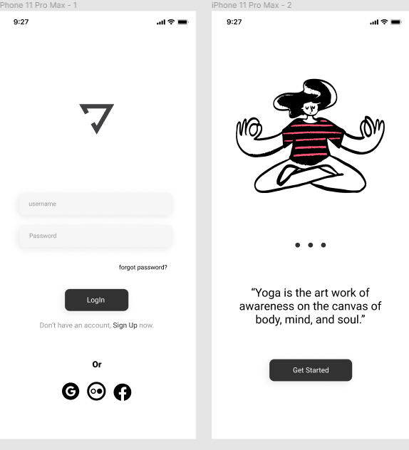

#Yoga-project

<h1> Yoga App ( HTML, CSS ) </h1>

 Página de Login de uma aplicação de yoga 

## 🤝 Colaboradores

<table>
  <tr>
    <td align="center">
      <a href="https://github.com/cristolfe-prog">
         
        
          <b>Cristolfe</b>
        
  </tr>
</table>

[⬆ Voltar ao topo](#Yoga-project) 
